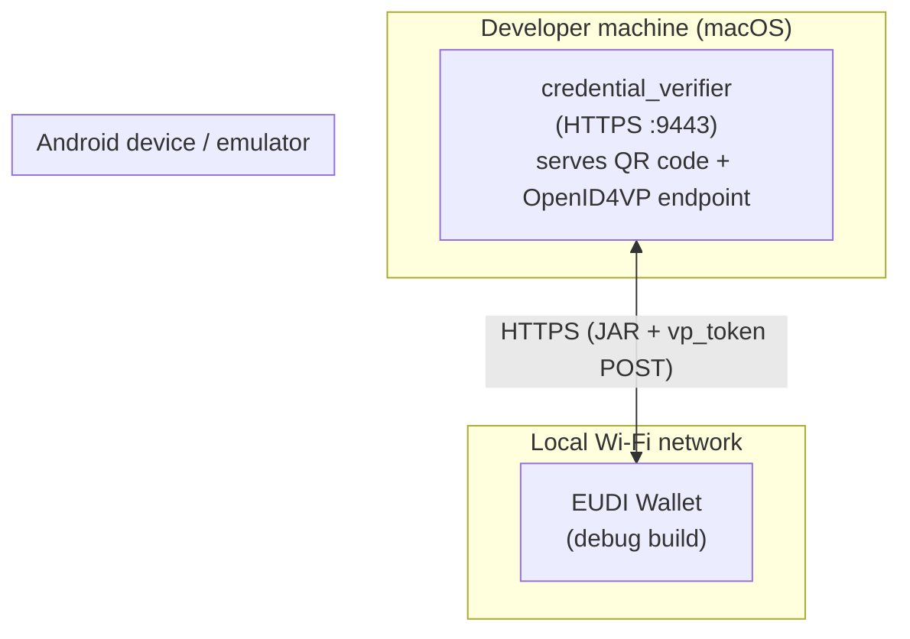
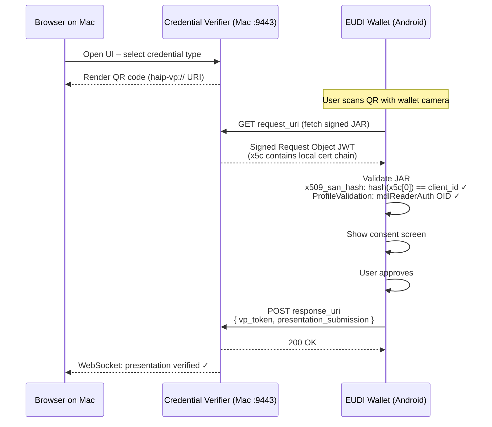
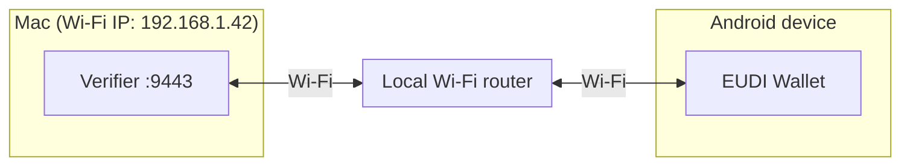
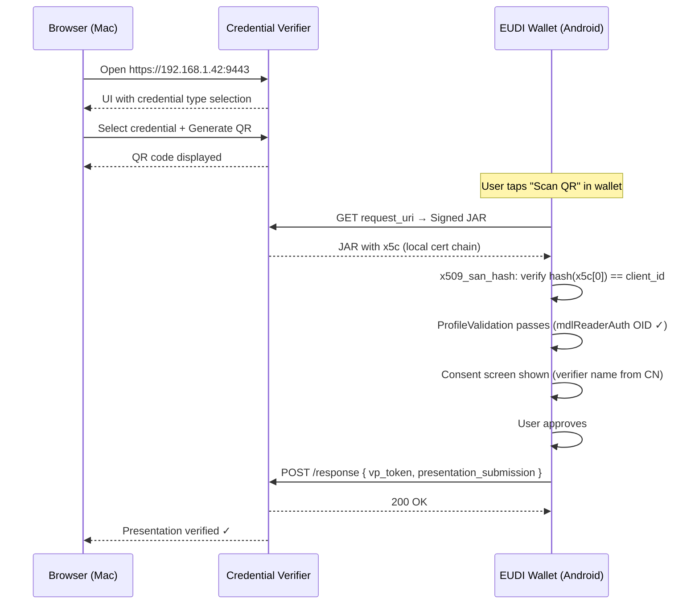

# Running the Credential Verifier and the EUDI Wallet on a Local Network

This guide explains how to run a credential verifier server and the EUDI Android Wallet side-by-side
on a local network using your own certificates, without any dependency on the European Commission's
hosted infrastructure.

---

## Table of Contents

1. [Architecture Overview](#architecture-overview)
2. [Would `x509_san_hash` Help?](#would-x509_san_hash-help)
3. [Prerequisites](#prerequisites)
4. [Step 1 – Generate Certificates for `x509_san_hash`](#step-1--generate-certificates-for-x509_san_hash)
5. [Step 2 – Configure the Credential Verifier](#step-2--configure-the-credential-verifier)
6. [Step 3 – Make the Verifier Reachable from the Android Device](#step-3--make-the-verifier-reachable-from-the-android-device)
7. [Step 4 – Configure the Wallet](#step-4--configure-the-wallet)
8. [Step 5 – Build and Run the Wallet](#step-5--build-and-run-the-wallet)
9. [Step 6 – End-to-End Test](#step-6--end-to-end-test)
10. [Choosing Between `x509_san_dns` and `x509_san_hash`](#choosing-between-x509_san_dns-and-x509_san_hash)
11. [Troubleshooting](#troubleshooting)
12. [Security Notes](#security-notes)

---

## Architecture Overview



**Flow summary:**



---

## Would `x509_san_hash` Help?

**Yes – `x509_san_hash` is the recommended approach for local-network development.**

| Concern | `x509_san_dns` | `x509_san_hash` |
|---|---|---|
| CA certificate must be bundled in the wallet APK | **Yes** (rebuild required) | **No** |
| Hostname must be resolvable from the device | **Yes** (DNS or `hosts` trick) | No hostname check |
| Self-signed cert accepted | Only if CA is in `ReaderTrustStore` | **Yes** |
| Certificate rotation breaks `client_id` | No | **Yes** (hash changes) |
| Works behind NAT / private IP | Extra DNS mapping needed | **Yes** |

With `x509_san_hash`:

1. Generate a self-signed or private-CA cert for the verifier (see Step 1).
2. Compute its SHA-256 fingerprint → that becomes `client_id`.
3. `ClientIdScheme.X509Hash` is already enabled in the default `WalletCoreConfigImpl` — no code change needed.
4. **No CA needs to be added to `ReaderTrustStore`** and **no hostname matching is required**.

> **Important caveat (wallet-core ≤ 0.25):** Even with `x509_san_hash`, the leaf certificate still
> passes through `ProfileValidation` (ISO 18013-5) because the wallet shares one `ReaderTrustStore`
> between the BLE proximity path and the remote OpenID4VP path.  The leaf certificate **must still**:
>
> * Include Extended Key Usage `mdlReaderAuth` OID `1.0.18013.5.1.6`
> * Have valid SKI and AKI (AKI must reference the issuer's SKI)
> * Use ECDSA (P-256 / P-384 / P-521), not RSA
> * Have a validity period ≤ 1 187 days
> * Include `CN` in the Subject
>
> See [eudi-lib-android-wallet-core#247](https://github.com/eu-digital-identity-wallet/eudi-lib-android-wallet-core/issues/247).

---

## Prerequisites

| Tool | Notes |
|---|---|
| `openssl` ≥ 3.x | `brew install openssl@3` |
| Android Studio Meerkat+ | For building the wallet |
| Android device or emulator (API 29+) | Physical device recommended for QR scanning |

---

## Step 1 – Generate Certificates for `x509_san_hash`

Save the following script as `generate_local_certs.sh` and run it from your verifier project
directory.  It generates:

* A **root CA** (needed in `ReaderTrustStore` because of the shared trust-store limitation above).
* A **leaf certificate** that satisfies all ISO 18013-5 `ProfileValidation` rules **and** includes TLS SANs.
* Prints the **`x509_san_hash` `client_id`** value you need to configure in the verifier.

```bash
#!/usr/bin/env bash
# generate_local_certs.sh
#
# Generates a Root CA + leaf certificate suitable for:
#   - x509_san_hash client_id scheme (EUDI wallet)
#   - HTTPS TLS (serverAuth EKU)
#   - ISO 18013-5 ProfileValidation (mdlReaderAuth OID, AKI/SKI, ECDSA, ≤1187 days)
#
# Usage:
#   chmod +x generate_local_certs.sh
#   ./generate_local_certs.sh [output_dir]
#
# Output:
#   <output_dir>/root.ca.pem          ← Add to wallet ReaderTrustStore
#   <output_dir>/server.key.pem       ← Private key for verifier
#   <output_dir>/server.cert.pem      ← Leaf certificate
#   <output_dir>/server.fullchain.pem ← leaf + root (use as x509_cert_path in verifier)
#
# The script prints the x509_san_hash client_id value at the end.

set -euo pipefail

OUT_DIR="${1:-local_certs}"
mkdir -p "$OUT_DIR"

# Detect local Wi-Fi IP (macOS: en0; Linux: first non-lo interface)
if [[ "$(uname)" == "Darwin" ]]; then
    LOCAL_IP="$(ipconfig getifaddr en0 2>/dev/null || echo "127.0.0.1")"
else
    LOCAL_IP="$(hostname -I | awk '{print $1}')"
fi

echo "=== Local IP: $LOCAL_IP ==="
echo "=== Output dir: $OUT_DIR ==="
echo ""

# ── 1. Root CA ─────────────────────────────────────────────────────────────────
echo "[1/4] Generating Root CA key and certificate..."

openssl genpkey \
    -algorithm EC \
    -pkeyopt ec_paramgen_curve:prime256v1 \
    -out "$OUT_DIR/root.key.pem"

openssl req -new -x509 \
    -days 1187 \
    -key "$OUT_DIR/root.key.pem" \
    -out "$OUT_DIR/root.ca.pem" \
    -subj "/CN=Local EUDI Verifier Root CA" \
    -addext "basicConstraints = critical, CA:TRUE, pathlen:0" \
    -addext "keyUsage = critical, keyCertSign, cRLSign" \
    -addext "subjectKeyIdentifier = hash"

echo "    ✓ root.ca.pem"

# ── 2. Leaf key ────────────────────────────────────────────────────────────────
echo "[2/4] Generating leaf key..."

openssl genpkey \
    -algorithm EC \
    -pkeyopt ec_paramgen_curve:prime256v1 \
    -out "$OUT_DIR/server.key.pem"

echo "    ✓ server.key.pem"

# ── 3. CSR ────────────────────────────────────────────────────────────────────
echo "[3/4] Generating CSR..."

openssl req -new \
    -key "$OUT_DIR/server.key.pem" \
    -out "$OUT_DIR/server.csr" \
    -subj "/CN=Local EUDI Verifier"

# Extensions file
# OID 1.0.18013.5.1.6 = mdlReaderAuth (REQUIRED by wallet ProfileValidation)
# OID 1.3.6.1.5.5.7.3.1 = serverAuth  (for HTTPS TLS)
# OID 1.3.6.1.5.5.7.3.2 = clientAuth  (optional but harmless)
cat > "$OUT_DIR/leaf_ext.cnf" <<EOF
[v3_leaf]
subjectKeyIdentifier   = hash
authorityKeyIdentifier = keyid:always
keyUsage               = critical, digitalSignature
extendedKeyUsage       = 1.3.6.1.5.5.7.3.1, 1.3.6.1.5.5.7.3.2, 1.0.18013.5.1.6
basicConstraints       = CA:FALSE
subjectAltName         = DNS:localhost, IP:127.0.0.1, IP:${LOCAL_IP}
EOF

echo "    ✓ server.csr"

# ── 4. Sign leaf with root CA ─────────────────────────────────────────────────
echo "[4/4] Signing leaf certificate with Root CA..."

openssl x509 -req \
    -sha256 \
    -days 1187 \
    -in "$OUT_DIR/server.csr" \
    -CA "$OUT_DIR/root.ca.pem" \
    -CAkey "$OUT_DIR/root.key.pem" \
    -CAcreateserial \
    -out "$OUT_DIR/server.cert.pem" \
    -extfile "$OUT_DIR/leaf_ext.cnf" \
    -extensions v3_leaf

echo "    ✓ server.cert.pem"

# Full chain: leaf first, then root (required by wallet x5c)
cat "$OUT_DIR/server.cert.pem" "$OUT_DIR/root.ca.pem" > "$OUT_DIR/server.fullchain.pem"
echo "    ✓ server.fullchain.pem"

# ── Print verification ─────────────────────────────────────────────────────────
echo ""
echo "=== Certificate details ==="
openssl x509 -in "$OUT_DIR/server.cert.pem" -noout -subject -dates
echo ""
echo "=== Extended Key Usage (must include 1.0.18013.5.1.6 = mdlReaderAuth) ==="
openssl x509 -in "$OUT_DIR/server.cert.pem" -noout -text | grep -A4 "Extended Key"

# ── Compute x509_san_hash client_id ──────────────────────────────────────────
HASH=$(openssl x509 -in "$OUT_DIR/server.cert.pem" -outform DER \
    | openssl dgst -sha256 -binary \
    | openssl base64 -A \
    | tr '+/' '-_' \
    | tr -d '=')

echo ""
echo "╔══════════════════════════════════════════════════════════════════════╗"
echo "║  x509_san_hash client_id (paste into verifier config)               ║"
echo "╠══════════════════════════════════════════════════════════════════════╣"
echo "║  x509_san_hash:${HASH}"
echo "╚══════════════════════════════════════════════════════════════════════╝"
echo ""
echo "Next steps:"
echo "  1. Copy ${OUT_DIR}/root.ca.pem to"
echo "     eudi-app-android-wallet-ui/resources-logic/src/main/res/raw/local_verifier_root_ca.pem"
echo "  2. Configure verifier: x509_cert_path = \"${OUT_DIR}/server.fullchain.pem\""
echo "  3. Configure verifier: client_id = \"x509_san_hash:${HASH}\""
echo "  4. Rebuild the wallet (see Step 4 of local_network.md)"
```

Run it:

```bash
chmod +x generate_local_certs.sh
./generate_local_certs.sh
```

---

## Step 2 – Configure the Credential Verifier

Edit `credential-server.toml` (or your verifier's equivalent config file):

```toml
# credential-server.toml  –  local development override

host_name = "0.0.0.0"
host_port = 9443

# Public URL reachable from the Android device (use your Mac's Wi-Fi IP)
public_root_url = "https://192.168.1.42:9443"

disable_authentication = true

[tls_params]
server_private_key  = "local_certs/server.key.pem"
server_certificate  = "local_certs/server.cert.pem"
server_ca_chain     = "local_certs/root.ca.pem"

[openid4vp_config.haip_config]
# Full chain used to sign the JAR (Authorization Request Object) – leaf first
x509_cert_path = "local_certs/server.fullchain.pem"
x509_key_path  = "local_certs/server.key.pem"

# Paste the value printed by generate_local_certs.sh
client_id = "x509_san_hash:<hash printed by the script>"
```

Start the verifier:

```bash
cargo run --bin credential-verifier -- --config credential-server.toml
```

---

## Step 3 – Make the Verifier Reachable from the Android Device



1. Find your Mac's Wi-Fi IP:
   ```bash
   ipconfig getifaddr en0
   # e.g. 192.168.1.42
   ```

2. Make sure the Android device is on the **same Wi-Fi network** as the Mac.

3. Open the verifier's firewall port (macOS):
   ```bash
   # Allow incoming connections on port 9443
   # System Settings → Network → Firewall → Options → Add credential-verifier
   ```

4. Verify connectivity from the device:
   Open `https://192.168.1.42:9443` in the Android browser.  You'll see a certificate warning
   (expected — the device doesn't trust the local CA yet), but the connection should reach the
   verifier.

> **With `x509_san_hash`, no DNS configuration is needed on the Android device.**  The IP address
> in `public_root_url` is sufficient for the wallet to reach the verifier, and the wallet validates
> the certificate by its hash rather than its hostname.

### Android Emulator Note

If using an emulator, the Mac's IP is reachable via the special address `10.0.2.2`:

```toml
public_root_url = "https://10.0.2.2:9443"
```

The `leaf_ext.cnf` in Step 1 already includes `IP:127.0.0.1` and `IP:<LOCAL_IP>` in the SAN.
Add `IP:10.0.2.2` if you need to support both physical device and emulator simultaneously.

---

## Step 4 – Configure the Wallet

### 4a – Add the Root CA to `ReaderTrustStore`

Even with `x509_san_hash`, the wallet still runs `ProfileValidation` on the leaf certificate
(shared trust store limitation — see [the caveat above](#would-x509_san_hash-help)).  The root CA
must therefore be known to the wallet.

Copy the generated root CA into the wallet's raw resources:

```bash
cp local_certs/root.ca.pem \
   eudi-app-android-wallet-ui/resources-logic/src/main/res/raw/local_verifier_root_ca.pem
```

Add it to `WalletCoreConfigImpl` in the flavour you are testing (`demo` or `dev`):

```kotlin
// core-logic/src/demo/java/eu/europa/ec/corelogic/config/WalletCoreConfigImpl.kt

configureReaderTrustStore(
    context,
    R.raw.pidissuerca02_eu,   // existing entries …
    // …
    R.raw.local_verifier_root_ca   // ← add this
)
```

### 4b – Allow Self-Signed TLS Certificates (HTTPS Transport)

The wallet's Ktor `HttpClient` (in `NetworkModule.kt`) uses the Android system CA store for TLS.
To allow connections to your local verifier's self-signed TLS certificate, replace
`provideHttpClient` with a dev-only trust-all variant:

```kotlin
// network-logic/src/main/java/…/NetworkModule.kt
// WARNING: only use this in debug/dev builds – never in production

@SuppressLint("TrustAllX509TrustManager", "CustomX509TrustManager")
@Single
fun provideHttpClient(json: Json): HttpClient {
    val trustAllCerts = arrayOf<TrustManager>(object : X509TrustManager {
        override fun checkClientTrusted(chain: Array<X509Certificate>, authType: String) {}
        override fun checkServerTrusted(chain: Array<X509Certificate>, authType: String) {}
        override fun getAcceptedIssuers(): Array<X509Certificate> = arrayOf()
    })
    return HttpClient(Android) {
        install(Logging) { level = LogLevel.ALL }
        install(ContentNegotiation) { json(json = json) }
        engine {
            sslManager = { conn ->
                conn.sslSocketFactory = SSLContext.getInstance("TLS").apply {
                    init(null, trustAllCerts, SecureRandom())
                }.socketFactory
                conn.hostnameVerifier = HostnameVerifier { _, _ -> true }
            }
        }
    }
}
```

A safer alternative: install only your local CA as a custom `TrustManager` instead of trusting all
certificates.

### 4c – `client_id_scheme` Configuration

Both `X509SanDns` and `X509Hash` are already enabled in the default `WalletCoreConfigImpl`.
No change is required for `x509_san_hash` support.

---

## Step 5 – Build and Run the Wallet

```bash
cd eudi-app-android-wallet-ui
./gradlew installDemoDebug
```

Or use Android Studio → Run.

---

## Step 6 – End-to-End Test



---

## Choosing Between `x509_san_dns` and `x509_san_hash`

```
Use x509_san_hash when:
  ✔ You have a self-signed or private-CA certificate
  ✔ You don't want to configure DNS on the Android device
  ✔ You are doing quick local development or integration testing
  ✔ The verifier's IP may change (the cert hash doesn't change with IP)

Use x509_san_dns when:
  ✔ You have a proper CA (internal or public) issuing verifier certificates
  ✔ You want certificate rotation to be transparent (CA trust persists)
  ✔ You are running a shared dev environment (multiple wallet builds connect)
  ✔ You are testing in a staging environment with a real domain
```

---

## Troubleshooting

### `InvalidJarJwt(cause=Untrusted x5c)`

1. Check the Extended Key Usage — must include `1.0.18013.5.1.6`:
   ```bash
   openssl x509 -in local_certs/server.cert.pem -text -noout | grep -A5 "Extended Key"
   ```
   If `1.0.18013.5.1.6` is missing, regenerate with the script in Step 1.

2. Check AKI/SKI are present:
   ```bash
   openssl x509 -in local_certs/server.cert.pem -text -noout | grep -A3 "Subject Key\|Authority Key"
   ```

3. Confirm the root CA is in `ReaderTrustStore` and the wallet was rebuilt.

4. Confirm validity ≤ 1 187 days:
   ```bash
   openssl x509 -in local_certs/server.cert.pem -noout -dates
   ```

### `CertPathValidatorException: Trust anchor not found`

* Root CA is not in `ReaderTrustStore` and not in `x5c`.
* Include root in `x5c` (use `server.fullchain.pem` for `x509_cert_path`).

### `ERR_CERT_AUTHORITY_INVALID` in Browser

Expected — the browser doesn't trust your local CA.  The wallet handles TLS separately via the
custom `TrustManager` (Step 4b).  To silence the browser warning, install `root.ca.pem` in macOS
Keychain.

### Wallet Cannot Reach the Verifier

* Check Mac firewall: **System Settings → Network → Firewall** — port 9443 must be open.
* Both devices must be on the same Wi-Fi network (check for AP client isolation).
* Test: `curl -k https://192.168.1.42:9443/` from the Mac.

### `x509_san_hash` `client_id` Mismatch

Recompute the hash and compare:

```bash
openssl x509 -in local_certs/server.cert.pem -outform DER \
    | openssl dgst -sha256 -binary \
    | openssl base64 -A \
    | tr '+/' '-_' \
    | tr -d '='
```

---

## Security Notes

* **Never ship the trust-all `TrustManager` in a production build.**  Guard it with
  `if (BuildConfig.DEBUG)` or a debug-only source set.
* The local CA and private keys generated by the script are for development only.
* `disable_authentication = true` in `credential-server.toml` disables mutual TLS.  Do not use this
  in production.

---

*Last updated: April 2026*

