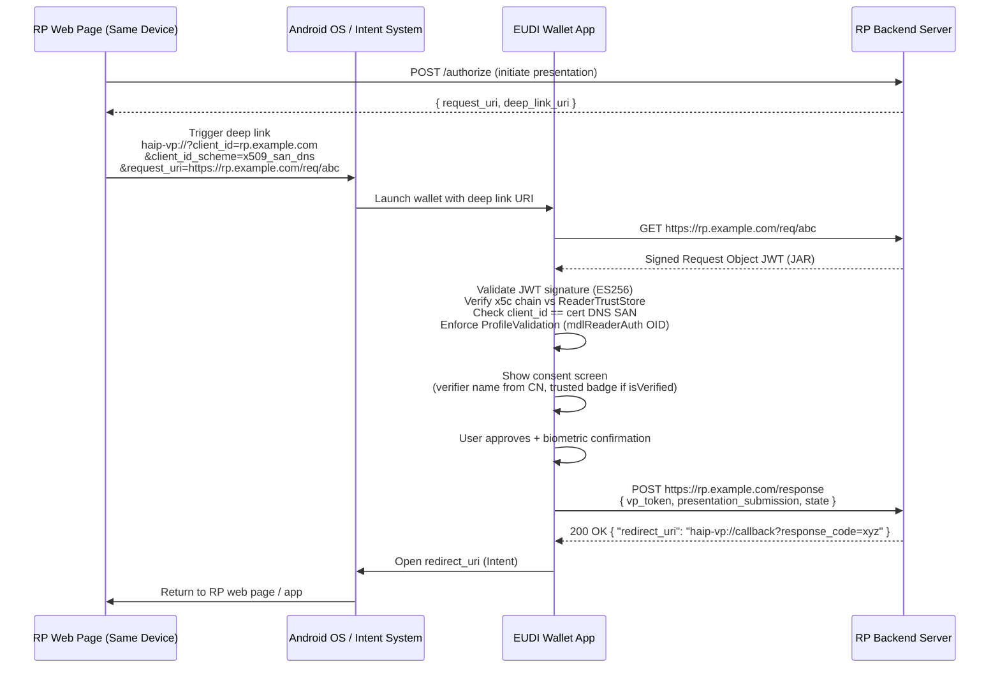
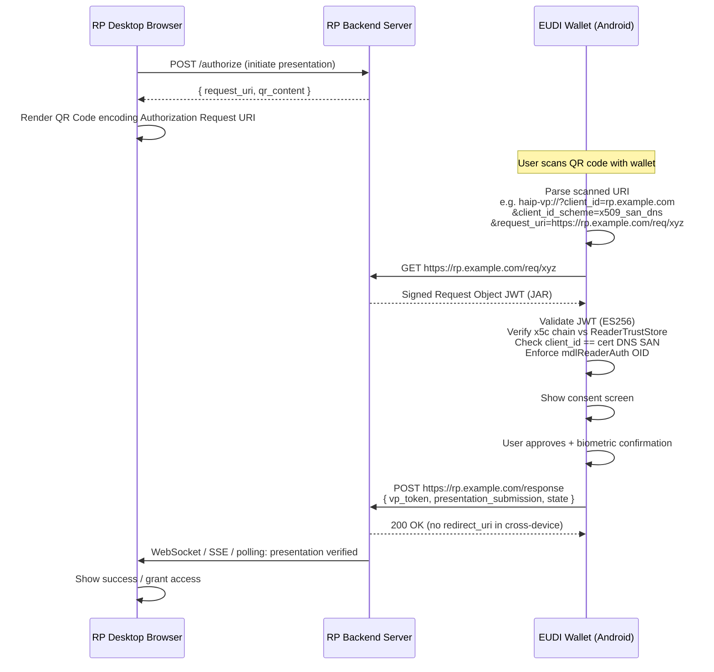
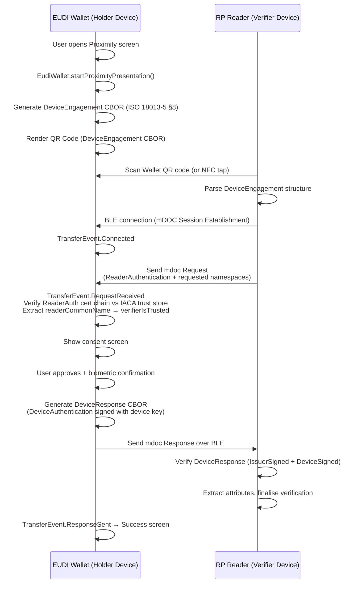

# Relying Party Requirements for the EUDI Android Wallet

This document describes **all** the technical requirements a Relying Party (RP) / Verifier must fulfil
for its OpenID4VP Authorization Requests to be accepted by the EUDI Android Wallet.

---

## Table of Contents

1. [JOSE and X5C – Technical Background](#1-jose-and-x5c--technical-background)
2. [Supported Client Identifier Schemes](#2-supported-client-identifier-schemes)
3. [x509_san_dns vs x509_san_hash](#3-x509_san_dns-vs-x509_san_hash)
4. [X.509 Certificate Profile](#4-x509-certificate-profile)
5. [Trust Anchor Configuration in the Wallet](#5-trust-anchor-configuration-in-the-wallet)
6. [Same-Device Flow](#6-same-device-flow)
7. [Cross-Device OpenID4VP Flow](#7-cross-device-openid4vp-flow)
8. [Cross-Device Proximity Flow (ISO 18013-5 BLE/NFC)](#8-cross-device-proximity-flow-iso-18013-5-blenfc)
9. [Credential Format Requirements](#9-credential-format-requirements)
10. [Credential Revocation Behaviour](#10-credential-revocation-behaviour)
11. [Summary of Hard Requirements](#11-summary-of-hard-requirements)
12. [Common Error Messages and Their Causes](#12-common-error-messages-and-their-causes)
13. [Known Limitations and GitHub Issues](#13-known-limitations-and-github-issues)
14. [Glossary](#14-glossary)
15. [Reference Specifications](#15-reference-specifications)

---

## 1. JOSE and X5C – Technical Background

### 1.1 JSON Object Signing and Encryption (JOSE)

[JOSE](https://datatracker.ietf.org/doc/html/rfc7165) is the umbrella term for a family of IETF
standards that define how to represent content protected by integrity, encryption, and key operations
using JSON-based data structures.  The four core RFCs are:

| Standard | RFC | Purpose |
|---|---|---|
| **JWS** – JSON Web Signature | [RFC 7515](https://www.rfc-editor.org/rfc/rfc7515) | Represent signed content. Defines Compact, JSON Flattened, and JSON General serialisations. |
| **JWE** – JSON Web Encryption | [RFC 7516](https://www.rfc-editor.org/rfc/rfc7516) | Represent encrypted content. |
| **JWK** – JSON Web Key | [RFC 7517](https://www.rfc-editor.org/rfc/rfc7517) | Represent cryptographic keys as JSON. |
| **JWT** – JSON Web Token | [RFC 7519](https://www.rfc-editor.org/rfc/rfc7519) | Claims-based tokens as a JWS (or JWE) payload. |
| **JWA** – JSON Web Algorithms | [RFC 7518](https://www.rfc-editor.org/rfc/rfc7518) | Registry of algorithms usable with JOSE (e.g. `ES256`). |

An OpenID4VP **Request Object** is a JWT, i.e. a signed token whose header specifies the algorithm
and key material (`x5c`), and whose payload carries the OpenID4VP claims (`client_id`,
`presentation_definition`, `nonce`, etc.).

### 1.2 The `x5c` JOSE Header Parameter

Defined in [RFC 7515 §4.1.6](https://www.rfc-editor.org/rfc/rfc7515#section-4.1.6), the `x5c`
parameter contains the X.509 certificate chain whose *leaf* certificate holds the public key used to
verify the JWT's signature.

```text
JOSE Header
{
  "alg": "ES256",                      ← signing algorithm
  "typ": "oauth-authz-req+jwt",        ← media type
  "x5c": [
    "<base64(DER(leaf certificate))>", ← [0] leaf – public key for sig verification
    "<base64(DER(intermediate CA))>",  ← [1] optional intermediate(s)
    "<base64(DER(root CA))>"           ← [2] root (recommended, not strictly required by RFC)
  ]
}
```

**Why does the wallet require `x5c`?**

The HAIP profile mandates that the RP authenticates itself through an X.509 certificate chain
embedded in `x5c`, rather than a pre-registered key.  The wallet uses the `x5c` chain to:

1. **Verify the JWT signature** using the public key in `x5c[0]` (the leaf certificate).
2. **Establish RP identity** – either by matching the leaf's DNS Subject Alternative Name against
   `client_id` (`x509_san_dns`) or by matching a SHA-256 hash of the leaf against `client_id`
   (`x509_san_hash`).
3. **Validate certificate chain trust** using the wallet's configured trust store
   (`configureReaderTrustStore`).
4. **Enforce ISO 18013-5 certificate profile rules** via `ProfileValidation` (see [Section 4](#4-x509-certificate-profile)).

### 1.3 JAR – JWT-Secured Authorization Request

The Request Object is specifically a **JAR** ([RFC 9101](https://www.rfc-editor.org/rfc/rfc9101)),
i.e. a JWT that contains all the parameters of an OAuth 2.0 / OpenID Authorization Request.  The
wallet fetches the JAR from `request_uri` (a URL reference pattern) or receives it inline in the
`request` parameter.  Unsigned (plain JSON) requests are **rejected**.

---

## 2. Supported Client Identifier Schemes

The wallet is configured in `WalletCoreConfigImpl` as follows (both `demo` and `dev` flavours):

```kotlin
configureOpenId4Vp {
    withClientIdSchemes(
        listOf(
            ClientIdScheme.X509SanDns,  // "x509_san_dns"
            ClientIdScheme.X509Hash     // "x509_san_hash"
        )
    )
    withSchemes(listOf(
        BuildConfig.OPENID4VP_SCHEME,       // "openid4vp"
        BuildConfig.EUDI_OPENID4VP_SCHEME,  // "eudi-openid4vp"
        BuildConfig.MDOC_OPENID4VP_SCHEME,  // "mdoc-openid4vp"
        BuildConfig.HAIP_OPENID4VP_SCHEME   // "haip-vp"
    ))
    withFormats(Format.MsoMdoc.ES256, Format.SdJwtVc.ES256)
}
```

The `Preregistered` scheme is supported at the library level but requires a static verifier entry in
the wallet build — it is **not enabled in production**.

---

## 3. x509_san_dns vs x509_san_hash

Both schemes embed the signing certificate chain in `x5c` and require the same X.509 profile.
The difference is **how the wallet resolves and trusts the RP's identity**.

### 3.1 `x509_san_dns`

```
client_id = "x509_san_dns:<hostname>"
```

* **Trust mechanism — CA-based.**  The wallet validates the `x5c` chain against the trust anchors
  in `ReaderTrustStore` (`configureReaderTrustStore`).
* **Identity binding.**  The wallet verifies that the hostname embedded in `client_id` appears as a
  **DNS Subject Alternative Name (SAN)** in the leaf certificate (`x5c[0]`).
* **Implications:**
  * The CA root certificate must be bundled in the wallet APK at build time.
  * The RP hostname must be resolvable from the Android device.
  * Certificate rotation is transparent — the CA trust persists as long as the same CA signs the new certificate.
  * Ideal for **production deployments** with a well-known CA.

### 3.2 `x509_san_hash`

```
client_id = "x509_san_hash:<base64url(SHA-256(DER-encoded leaf certificate))>"
```

* **Trust mechanism — certificate pinning.**  The wallet computes SHA-256 of the DER-encoded leaf
  certificate in `x5c[0]` and checks it matches the hash in `client_id`.  No CA lookup is performed
  for identity binding.
* **Identity binding.**  The `client_id` *is* the fingerprint.  Possession of the matching private
  key proves identity.
* **Implications:**
  * No CA certificate needs to be in `ReaderTrustStore` for the hash check itself (the chain must
    still be validated per [Section 5](#5-trust-anchor-configuration-in-the-wallet)).
  * No hostname matching is required.
  * The `client_id` must be recomputed on every certificate rotation.
  * Ideal for **local/dev environments** with self-signed certificates.

### 3.3 Side-by-side comparison

| Property | `x509_san_dns` | `x509_san_hash` |
|---|---|---|
| Trust root | CA in `ReaderTrustStore` | SHA-256 fingerprint of leaf cert |
| `client_id` content | hostname (matches DNS SAN) | `base64url(SHA-256(DER leaf))` |
| Certificate rotation | Transparent | Requires new `client_id` |
| Pre-bundled CA required | **Yes** | No (still needed for chain validation — see §5) |
| Hostname verification | **Yes** (DNS SAN must match) | No |
| Works with self-signed / private-CA certs | Limited | **Yes** |
| Good for production | **Yes** | Less convenient |
| Good for local dev / local network | Limited | **Yes** |

> **Practical rule:** use `x509_san_dns` in production with a well-known CA, and `x509_san_hash` in
> development / local-network environments.

---

## 4. X.509 Certificate Profile

The leaf certificate (`x5c[0]`) is validated by two independent layers:

1. **JAR/JWS layer** — signature verification using the public key in the leaf cert.
2. **ISO 18013-5 `ProfileValidation` layer** — invoked through `ReaderTrustStore`.  This is the
   source of most `Untrusted x5c` errors.

### 4.1 Mandatory Extensions

| Extension | Requirement |
|---|---|
| Subject Key Identifier (SKI) | **Must be present** |
| Authority Key Identifier (AKI) | **Must be present** and must reference the issuer's SKI |
| Common Name (`CN`) | **Must be present** in the Subject (used as the displayed verifier name in the UI) |
| Key Usage | **Must include `digitalSignature`** |
| Extended Key Usage | **Must include OID `1.0.18013.5.1.6`** (`mdlReaderAuth`) |

### 4.2 Prohibited Critical Extensions

The following extensions **must not be marked critical**:

* `policyMappings`
* `nameConstraints`
* `policyConstraints`
* `inhibitAnyPolicy`
* `freshestCRL`

### 4.3 Signature Algorithm

The certificate **must be signed** with one of:

* `ecdsa-with-SHA256`
* `ecdsa-with-SHA384`
* `ecdsa-with-SHA512`

RSA signature algorithms are **not supported**.

### 4.4 Validity Period

The validity period of the leaf certificate **must not exceed 1 187 days** (~3.25 years).

### 4.5 Chain Requirements

* The `x5c` array must contain the chain **leaf first**.
* Including intermediate certificates is strongly recommended.
* The root CA must be resolvable either from `x5c` itself or from `ReaderTrustStore`.  In practice,
  include the root in `x5c`.

### 4.6 Summary OpenSSL Extensions Block

```ini
[ reader_leaf ]
subjectKeyIdentifier   = hash
authorityKeyIdentifier = keyid:always
keyUsage               = critical, digitalSignature
extendedKeyUsage       = 1.0.18013.5.1.6   # mdlReaderAuth — MANDATORY
basicConstraints       = CA:FALSE
# validity ≤ 1187 days; signature algorithm must be ECDSA
```

> ⚠️ **The `mdlReaderAuth` OID (`1.0.18013.5.1.6`) is the most common omission** causing
> `InvalidJarJwt(cause=Untrusted x5c)`.  See
> [eudi-lib-android-wallet-core#247](https://github.com/eu-digital-identity-wallet/eudi-lib-android-wallet-core/issues/247).

---

## 5. Trust Anchor Configuration in the Wallet

`ReaderTrustStore` is configured in `WalletCoreConfigImpl`:

```kotlin
configureReaderTrustStore(
    context,
    R.raw.pidissuerca02_cz,
    R.raw.pidissuerca02_ee,
    R.raw.pidissuerca02_eu,
    R.raw.pidissuerca02_lu,
    R.raw.pidissuerca02_nl,
    R.raw.pidissuerca02_pt,
    R.raw.pidissuerca02_ut,
    R.raw.dc4eu,
    R.raw.r45_staging
)
```

**Key facts:**

* Only the **root CA** certificate needs to be in `ReaderTrustStore`; intermediates may be in `x5c`.
* `ReaderTrustStore` is **shared** between the proximity BLE path and the OpenID4VP remote path.
  Because the proximity path enforces the ISO 18013-5 profile (including `mdlReaderAuth` OID), this
  OID is **also enforced for remote OpenID4VP** in current releases.
* `ReaderTrustStore` is initialised once at startup.  A rebuild is required to add a new PEM file.
* The wallet's Ktor `HttpClient` uses the **Android system CA trust store** for TLS — this is a
  separate mechanism from `ReaderTrustStore`.  A certificate valid for `ReaderTrustStore` does NOT
  automatically work for TLS (and vice versa).

---

## 6. Same-Device Flow

### 6.1 Overview

In the same-device flow the RP website and the wallet run on the **same Android device**.  The RP
triggers the wallet via a deep link (Android Intent URI) using one of the registered URI schemes.
The wallet processes the request, collects user consent, and POSTs the VP Token directly to the RP's
`response_uri`.  If the RP returns a `redirect_uri` in its response body, the wallet navigates to it
after the presentation, returning control to the RP's app or browser tab.

### 6.2 Sequence Diagram



### 6.3 URI Scheme Requirements

The wallet registers Android intent filters for the following URI schemes.  The RP **MUST** use one
of them to trigger the wallet:

| URI Scheme | Purpose |
|---|---|
| `haip-vp://` | HAIP-specific OpenID4VP (recommended for HAIP-compliant RPs) |
| `openid4vp://` | Standard OpenID4VP scheme |
| `eudi-openid4vp://` | EUDI-specific OpenID4VP scheme |
| `mdoc-openid4vp://` | mDoc-specific OpenID4VP scheme |

The host component is treated as a wildcard (`*`) — the wallet accepts any host for these schemes.

**Example deep-link URI:**

```
haip-vp://?client_id=rp.example.com
          &client_id_scheme=x509_san_dns
          &request_uri=https%3A%2F%2Frp.example.com%2Frequest%2Fabc123
```

For scalability, use `request_uri` by reference — embedding the full Request Object JWT in the URI
bloats it.

### 6.4 Authorization Request Parameters

| Parameter | Requirement |
|---|---|
| `client_id` | **REQUIRED.** For `x509_san_dns`: exact DNS hostname matching the SAN of the leaf cert in `x5c`. For `x509_san_hash`: `base64url(SHA-256(DER(leaf_cert)))`. |
| `client_id_scheme` | **REQUIRED.** MUST be `x509_san_dns` or `x509_san_hash`. |
| `request_uri` | **STRONGLY RECOMMENDED.** URL from which the wallet fetches the signed Request Object. MUST use `https://`. |
| `request` | Alternative to `request_uri`. JWT by value. Same signing requirements. |
| `response_type` | **REQUIRED.** MUST be `vp_token`. |
| `response_mode` | **REQUIRED.** MUST be `direct_post` or `direct_post.jwt`. |
| `response_uri` | **REQUIRED** when `response_mode` is `direct_post`. HTTPS endpoint for the VP Token POST. |
| `nonce` | **REQUIRED.** Cryptographically random, single-use. |
| `state` | RECOMMENDED. Opaque value for session correlation. |
| `presentation_definition` | REQUIRED (unless using `dcql_query`). |
| `dcql_query` | REQUIRED (alternative to `presentation_definition`). |

> ⚠️ **HAIP requirement:** The `request_uri` endpoint MUST return a signed JAR.  Unsigned JSON is rejected.

### 6.5 Request Object Signing Requirements

| Property | Requirement |
|---|---|
| `alg` (JOSE header) | **MUST be `ES256`** (ECDSA P-256). All other algorithms are rejected. |
| `x5c` (JOSE header) | **REQUIRED.** Array: `[leaf_DER_base64, intermediate_DER_base64?, root_DER_base64?]` |
| `kid` (JOSE header) | OPTIONAL. If present, must identify the leaf certificate. |
| `iss` (JWT claim) | MUST equal `client_id`. |
| `aud` (JWT claim) | SHOULD be the wallet identifier or omitted. |
| `exp` (JWT claim) | **REQUIRED.** Request Object must have an expiry time. |
| `iat` (JWT claim) | **REQUIRED.** Issuance time. |
| `nonce` (JWT claim) | **REQUIRED.** Same value as the `nonce` query parameter. |

### 6.6 TLS / Transport Security Requirements

| Endpoint | TLS Requirement |
|---|---|
| `request_uri` endpoint | Valid TLS certificate from a **publicly-trusted CA** (Android system store). TLS 1.2 min; TLS 1.3 recommended. |
| `response_uri` endpoint | Valid TLS certificate from a **publicly-trusted CA**. |
| Any server the wallet connects to | No self-signed certificates; no private/internal CAs (unless wallet is reconfigured). |

The wallet's Ktor `HttpClient` uses the unmodified Android TLS stack (`NetworkModule.kt`).
Connections to servers with self-signed or privately-rooted TLS certificates fail at the TLS layer.
The wiki (`how_to_build.md`) documents a trust-all workaround for development using
`ClientIdScheme.Preregistered`.

### 6.7 Credential / Presentation Definition Requirements

#### MSO mDOC (ISO 18013-5)

Use `presentation_definition` with `format.mso_mdoc` or a DCQL query.

| DocType | Description |
|---|---|
| `eu.europa.ec.eudi.pid.1` | EUDI Person Identification Data (PID) |
| `org.iso.18013.5.1.mDL` | Mobile Driving Licence |
| `org.iso.23220.2.photoid.1` | Photo ID |
| `org.iso.23220.photoID.1` | Photo ID (alternative) |
| `eu.europa.ec.eudi.tax.1` | Tax document |
| `eu.europa.ec.eudi.iban.1` | IBAN |
| `eu.europa.ec.eudi.hiid.1` | Health Insurance ID |
| `eu.europa.ec.eudi.ehic.1` | European Health Insurance Card |
| `eu.europa.ec.eudi.pda1.1` | Portable Document A1 |
| `eu.europa.ec.eudi.por.1` | Power of Representation |
| `eu.europa.ec.eudi.msisdn.1` | MSISDN |

#### SD-JWT VC

Use `presentation_definition` with `format.vc+sd-jwt` or a DCQL query.

| VCT | Description |
|---|---|
| `urn:eudi:pid:1` | EUDI PID – SD-JWT VC format |
| `urn:eu.europa.ec.eudi:tax:1` | Tax document |
| `urn:eu.europa.ec.eudi:iban:1` | IBAN |
| `urn:eu.europa.ec.eudi:hiid:1` | Health Insurance ID |
| `urn:eu.europa.ec.eudi:ehic:1` | European Health Insurance Card |
| `urn:eu.europa.ec.eudi:pda1:1` | Portable Document A1 |
| `urn:eu.europa.ec.eudi:por:1` | Power of Representation |
| `urn:eu.europa.ec.eudi:msisdn:1` | MSISDN |
| `urn:eu.europa.ec.eudi:pseudonym_age_over_18:1` | Age-over-18 pseudonym |

### 6.8 Response Endpoint Requirements

The wallet POSTs the VP Token as `application/x-www-form-urlencoded` to `response_uri`.

* MUST be an `https://` URL.
* MUST accept POST bodies containing:
  * `vp_token` — VP Token (mDoc DeviceResponse as base64url CBOR, or SD-JWT VC string).
  * `presentation_submission` — PresentationSubmission JSON object.
  * `state` — if provided in the original request, echoed back.
* MUST respond with HTTP 200 OK.
* MAY include a JSON body with `redirect_uri` for same-device return:
  ```json
  { "redirect_uri": "haip-vp://callback?response_code=abc" }
  ```
* MUST NOT use 301/302 redirects.

### 6.9 Redirect URI Requirements

After posting the VP Token, the wallet follows the `redirect_uri` returned by the RP:

* MUST be a URI the Android OS can route (typically `https://` App Link or custom URI scheme).
* MUST NOT be a `javascript:` URI.
* The wallet opens the URI via Android Intent; unresolvable URIs are silently absorbed.
* The `redirect_uri` and verifier name (from leaf cert `CN`) are shown on the success screen.

### 6.10 Verifier Trust Indication

The wallet displays a **verified badge** when the RP's certificate chain validates:

```kotlin
val isTrusted = requestedDocuments.requestedDocuments
    .firstOrNull()?.readerAuth?.isVerified == true
verifierIsTrusted = isTrusted
```

The verifier name comes from `readerAuth.readerCommonName` (the `CN` of the leaf certificate).
An unverifiable RP shows an *unverified* warning; the user can still consent.

---

## 7. Cross-Device OpenID4VP Flow

### 7.1 Overview

The RP is on a **different device** (desktop browser, web kiosk) while the wallet is on the user's
phone.  The RP renders a QR code.  The user scans it with the wallet.  The wallet fetches the
Request Object over HTTPS, collects consent, and POSTs the VP Token to `response_uri`.
There is **no redirect_uri** in the cross-device variant.

### 7.2 Sequence Diagram



### 7.3 QR Code Requirements

* The QR code MUST encode a URI using a wallet-registered scheme:
  `haip-vp`, `openid4vp`, `eudi-openid4vp`, or `mdoc-openid4vp`.
* Use `request_uri` by reference (not inline JWT — too large for reliable QR scanning).
* Minimum QR code size: 200 × 200 px; higher recommended.
* Regenerate QR code per session (new `nonce` and `request_uri`) to prevent replay.

**Example QR content:**

```
haip-vp://?client_id=rp.example.com
          &client_id_scheme=x509_san_dns
          &request_uri=https%3A%2F%2Frp.example.com%2Frequest%2Fxyz789
          &response_type=vp_token
          &response_mode=direct_post
```

### 7.4 `request_uri` Endpoint Requirements

| Requirement | Detail |
|---|---|
| Protocol | MUST be `https://` with a publicly-trusted TLS certificate |
| Content-Type | MUST be `application/oauth-authz-req+jwt` or `application/jwt` |
| Body | MUST be a signed Request Object JWT. Plain JSON objects are rejected. |
| Authentication | MUST NOT require authentication from the wallet (unauthenticated GET) |
| Single-use | SHOULD invalidate the URI after first fetch |
| TTL | SHOULD be ≤ 5 minutes on the JWT `exp` claim |

### 7.5 Response Endpoint

Identical to the same-device response endpoint ([§6.8](#68-response-endpoint-requirements)) with one
difference: **do not return a `redirect_uri`** in the cross-device flow.  Notify the desktop browser
via WebSocket, Server-Sent Events (SSE), or polling.

---

## 8. Cross-Device Proximity Flow (ISO 18013-5 BLE/NFC)

### 8.1 Overview

The proximity flow implements **ISO/IEC 18013-5 mDOC presentation** over BLE or NFC.  Key
difference from the OpenID4VP flows: **the wallet generates the QR code** — not the RP.  The RP
reader scans the wallet's QR, connects over BLE, and exchanges data locally.

* Wallet = **mDOC holder device** (BLE peripheral / NFC card emulator).
* RP reader = **mDOC reader device** (BLE central / NFC reader).

### 8.2 Sequence Diagram



### 8.3 Device Engagement QR Code (Generated by the Wallet)

The wallet generates the QR code encoding the `DeviceEngagement` CBOR per ISO 18013-5 §8.3.1.

The RP reader MUST:

* Implement ISO 18013-5 QR-code engagement parsing.
* Parse CBOR `DeviceEngagement` to extract BLE connection parameters.
* Initiate BLE central role and connect to the wallet.

The wallet also supports **NFC engagement** via `NfcEngagementService` (HCE).

### 8.4 Reader Authentication Requirements

The RP reader MUST include a `ReaderAuthentication` structure in the mdoc request
(ISO 18013-5 §9.1.4):

```
ReaderAuthentication = [
  "ReaderAuthentication",
  SessionTranscript,
  ItemsRequestBytes
]
```

The wallet evaluates `readerAuth.isVerified`:

* The reader certificate (`x5chain`) MUST chain to an IACA root in `ReaderTrustStore`.
* The `ReaderAuthentication` MUST be signed with **ES256** (ECDSA P-256 + SHA-256).
* The displayed verifier name comes from the `CN` of the reader certificate's Subject.

### 8.5 IACA Trust Store (Proximity — Bundled PEM Files)

| File | Description |
|---|---|
| `pidissuerca02_cz.pem` | PID Issuer CA – Czech Republic |
| `pidissuerca02_ee.pem` | PID Issuer CA – Estonia |
| `pidissuerca02_eu.pem` | PID Issuer CA – EU (EUDIW) |
| `pidissuerca02_lu.pem` | PID Issuer CA – Luxembourg |
| `pidissuerca02_nl.pem` | PID Issuer CA – Netherlands |
| `pidissuerca02_pt.pem` | PID Issuer CA – Portugal |
| `pidissuerca02_ut.pem` | PID Issuer CA – UT (test) |
| `dc4eu.pem` | DC4EU root CA |
| `r45_staging.pem` | R45 staging root CA |

If the reader certificate does **not** chain to one of these roots, `verifierIsTrusted = false`.
The wallet still presents the request but the UI shows an *unverified* warning.

### 8.6 BLE and NFC Transport Requirements

| Feature | Requirement |
|---|---|
| BLE | **REQUIRED.** Reader MUST support BLE central role. |
| BLE version | BLE 4.2+; BLE 5.0 recommended. |
| NFC | OPTIONAL. ISO 14443 Type 4 compliant. |
| BLE MTU | SHOULD negotiate ≥ 512 bytes. |
| BLE GATT | MUST implement ISO 18013-5 GATT service and characteristic UUIDs. |

### 8.7 mdoc Request Structure

```
SessionData {
  DeviceRequest {
    version: "1.0",
    docRequests: [{
      itemsRequest: {
        docType: "eu.europa.ec.eudi.pid.1",
        nameSpaces: {
          "eu.europa.ec.eudi.pid.1": {
            "family_name": false,
            "given_name":  false,
            "birth_date":  false
          }
        }
      },
      readerAuth: {
        x5chain: [ <DER-encoded reader cert> ],
        signature: <ES256 over ReaderAuthentication CBOR>
      }
    }]
  }
}
```

---

## 9. Credential Format Requirements

| Format | Encoding | Signing Algorithm | Wallet Support |
|---|---|---|---|
| MSO mDOC (ISO 18013-5) | CBOR | ECDSA P-256 (ES256) | ✅ Full |
| SD-JWT VC | JSON + JWS | ECDSA P-256 (ES256) | ✅ Full |

Only `ES256` is supported.  Requests specifying `RS256`, `PS256`, or `EdDSA` in `vp_formats` will
not match any credential.

**Credential policy:** PID documents are `OneTimeUse` with 10–60 credentials batched per flavour.
Each presentation consumes one credential.  The RP MUST NOT expect the same key/certificate in
multiple presentations.

---

## 10. Credential Revocation Behaviour

The wallet checks document status every 15 minutes (configurable via `WalletCoreConfig.revocationInterval`).

| Status | Behaviour |
|---|---|
| Valid | Document available for presentation. |
| Invalid (revoked) | Excluded from consent screen; cannot be presented. |
| Suspended | Excluded from consent screen. |

If all matching documents for the requested credential type are revoked, the wallet presents the user
with a `NoData` state.  The RP MUST handle VP Token responses where the requested credential is absent.

---

## 11. Summary of Hard Requirements

| # | Requirement | Flow |
|---|---|---|
| R1 | RP MUST use URI scheme `haip-vp`, `openid4vp`, `eudi-openid4vp`, or `mdoc-openid4vp` | Same-device, Cross-device OID4VP |
| R2 | `client_id_scheme` MUST be `x509_san_dns` or `x509_san_hash` | Same-device, Cross-device OID4VP |
| R3 | Request Object MUST be a signed JWT with `alg: ES256` | Same-device, Cross-device OID4VP |
| R4 | `x5c` JOSE header MUST contain the full certificate chain (leaf first) | Same-device, Cross-device OID4VP |
| R5 | For `x509_san_dns`: `client_id` MUST exactly match the DNS SAN of the leaf certificate | Same-device, Cross-device OID4VP |
| R6 | Leaf certificate MUST contain Extended Key Usage `mdlReaderAuth` OID `1.0.18013.5.1.6` | All OID4VP flows |
| R7 | Leaf certificate MUST have valid SKI and AKI (AKI must point to issuer's SKI) | All OID4VP flows |
| R8 | Leaf certificate MUST include Key Usage `digitalSignature` | All OID4VP flows |
| R9 | Leaf certificate validity period MUST NOT exceed 1 187 days | All OID4VP flows |
| R10 | All RP HTTPS endpoints MUST have publicly-trusted TLS certificates | All OID4VP flows |
| R11 | `response_mode` MUST be `direct_post` or `direct_post.jwt` | Same-device, Cross-device OID4VP |
| R12 | `response_uri` MUST be an HTTPS endpoint accepting `application/x-www-form-urlencoded` POST | Same-device, Cross-device OID4VP |
| R13 | Cross-device QR code MUST encode an OpenID4VP URI using a wallet-registered scheme | Cross-device OID4VP |
| R14 | Reader certificate MUST chain to an IACA root in the wallet's trust store for trusted status | Proximity BLE |
| R15 | Reader MUST sign `ReaderAuthentication` with ES256 | Proximity BLE |
| R16 | Reader MUST implement ISO 18013-5 BLE GATT profile | Proximity BLE |
| R17 | Credential format MUST be MSO mDOC (ES256) or SD-JWT VC (ES256) | All flows |
| R18 | `nonce` MUST be present and single-use | All OID4VP flows |
| R19 | Self-signed TLS or request-signing certificates are NOT accepted in production | All flows |

---

## 12. Common Error Messages and Their Causes

| Error | Likely Cause | Fix |
|---|---|---|
| `InvalidJarJwt(cause=Untrusted x5c)` | Missing `mdlReaderAuth` OID, missing root CA in `ReaderTrustStore`, or missing SKI/AKI | Add OID `1.0.18013.5.1.6` to leaf cert; add CA to trust store |
| `CertPathValidatorException: Trust anchor not found` | Root CA not in `ReaderTrustStore` and not in `x5c` | Include root in `x5c` and/or `ReaderTrustStore` |
| `Field 'vp_formats' is required … but it was missing` | OpenID4VP 1.0 `client_metadata` incomplete | Add `vp_formats` to `client_metadata` |
| `InvalidJarJwt(cause=…)` with `x509_san_dns` | DNS SAN in leaf cert does not match `client_id` hostname | Ensure leaf cert's DNS SAN equals `client_id` |
| Validity period check failure | Leaf cert validity > 1 187 days | Re-issue with `-days 1187` or shorter |
| Signature algorithm mismatch | Cert signed with RSA | Use ECDSA P-256/P-384/P-521 |
| TLS handshake failure | Private/self-signed TLS cert on RP server | Use publicly-trusted TLS cert; or trust-all `HttpClient` for dev |

---

## 13. Known Limitations and GitHub Issues

| Issue | Description | Status |
|---|---|---|
| [eudi-app-android-wallet-ui#500](https://github.com/eu-digital-identity-wallet/eudi-app-android-wallet-ui/issues/500) | TrustStore update with new PEM does not make verifier request trusted | Closed – resolved by correct cert profile |
| [eudi-lib-android-wallet-core#230](https://github.com/eu-digital-identity-wallet/eudi-lib-android-wallet-core/issues/230) | `configureReaderTrustStore` has no effect / `Untrusted x5c` | Closed – `mdlReaderAuth` OID + valid AKI/SKI required |
| [eudi-lib-android-wallet-core#247](https://github.com/eu-digital-identity-wallet/eudi-lib-android-wallet-core/issues/247) | `ReaderTrustStore` shared between proximity and remote VP – `mdlReaderAuth` OID enforced for all flows | Open – separate trust stores on the roadmap |
| [eudi-app-android-wallet-ui#439](https://github.com/eu-digital-identity-wallet/eudi-app-android-wallet-ui/issues/439) | Wallet incompatible with verifier 0.6.0 (OpenID4VP draft vs 1.0) | Closed – wallet updated to OpenID4VP 1.0 |

---

## 14. Glossary

| Term | Definition |
|---|---|
| **HAIP** | High Assurance Interoperability Profile. A profile of OpenID4VP mandating X.509 certificate-based RP authentication, `direct_post` response mode, and ES256 signing. Defined by the OpenID Foundation and referenced by the EUDI ARF. |
| **OpenID4VP** | OpenID for Verifiable Presentations. A protocol built on OAuth 2.0 allowing a Verifier (RP) to request credential presentation from a Wallet. |
| **JOSE** | JSON Object Signing and Encryption. Umbrella term for RFC 7515 (JWS), RFC 7516 (JWE), RFC 7517 (JWK), RFC 7518 (JWA), RFC 7519 (JWT). |
| **JWS** | JSON Web Signature (RFC 7515). Defines how to represent signed content, including Compact Serialization (`header.payload.signature`). |
| **JWT** | JSON Web Token (RFC 7519). A signed (JWS) or encrypted (JWE) token carrying JSON claims. |
| **JAR** | JWT-Secured Authorization Request (RFC 9101). An Authorization Request whose parameters are embedded in a signed JWT. |
| **x5c** | JOSE header parameter (RFC 7515 §4.1.6) containing an X.509 certificate chain (base64-DER, leaf first) used to verify the JWT's signature. |
| **client_id** | The identifier of the RP in an OpenID4VP Authorization Request. In HAIP its value is constrained by `client_id_scheme`. |
| **client_id_scheme** | Defines how `client_id` is interpreted. This wallet supports `x509_san_dns` and `x509_san_hash`. |
| **x509_san_dns** | Client ID scheme where the RP's identity is a DNS name matching the Subject Alternative Name of the leaf cert in `x5c`. |
| **x509_san_hash** | Client ID scheme where `client_id` is `base64url(SHA-256(DER(leaf_cert)))`. Certificate pinning without CA lookup. |
| **Request Object** | A signed JWT (JAR) containing all OpenID4VP Authorization Request parameters. Served from `request_uri`. |
| **request_uri** | URL from which the wallet fetches the signed Request Object. Keeps the Authorization Request URI (and QR code) compact. |
| **response_uri** | HTTPS endpoint where the wallet POSTs the VP Token. Used with `response_mode: direct_post`. |
| **response_mode** | How the wallet returns the VP Token. `direct_post` = wallet POSTs to `response_uri`. `direct_post.jwt` = encrypted POST. |
| **VP Token** | Verifiable Presentation Token. The wallet's response containing disclosed credential attributes signed by the holder's device key. |
| **Presentation Definition** | JSON structure (DIF Presentation Exchange) specifying which credential types and attributes the RP requests. |
| **DCQL** | Digital Credential Query Language. Alternative to Presentation Definition for specifying requested credentials. Part of OpenID4VP. |
| **MSO mDOC** | Mobile Security Object Mobile Document. Credential format defined by ISO 18013-5. CBOR-encoded. |
| **SD-JWT VC** | Selective Disclosure JSON Web Token Verifiable Credential. JWT-based credential with selective disclosure. |
| **ES256** | ECDSA with P-256 and SHA-256. The only signing algorithm supported by this wallet for credential formats and request signing. |
| **IACA** | Issuer Authority Certificate Authority. Root CA for the mDOC ecosystem. Proximity reader certs must chain to a trusted IACA. |
| **ReaderAuthentication** | ISO 18013-5 structure signed by the RP reader to prove its identity. Contains session transcript and request bytes. |
| **DeviceEngagement** | ISO 18013-5 CBOR structure generated by the **wallet** encoding BLE/NFC connection parameters. Displayed as a QR code for the RP to scan in the proximity flow. |
| **Device Engagement QR** | QR code generated by the wallet (not the RP) in the proximity flow. The RP reader scans it to initiate BLE. |
| **ReaderTrustStore** | Wallet-side store of trusted CA certificates. Configured via `configureReaderTrustStore(…)`. Shared between proximity and remote OpenID4VP paths. |
| **ProfileValidation** | ISO 18013-5 certificate validation logic enforced by `ReaderTrustStore`. Requires `mdlReaderAuth` OID, valid SKI/AKI, etc. |
| **mdlReaderAuth OID** | OID `1.0.18013.5.1.6`. Extended Key Usage value required by ISO 18013-5 for reader certificates. Also enforced for remote OpenID4VP (see §4). |
| **SAN** | Subject Alternative Name. X.509v3 extension containing additional identities (DNS, IP, email) for the certificate subject. |
| **DPoP** | Demonstration of Proof of Possession. Mechanism binding access tokens to a client key pair. Used in OpenID4VCI issuance (`DPopConfig.Default`). |
| **PAR** | Pushed Authorization Request (RFC 9126). Client pushes Authorization Request to the server before redirecting the user. Supported in issuance (`ParUsage.IF_SUPPORTED`). |
| **Wallet Attestation** | Signed JWT from the Wallet Provider attesting to the wallet instance's authenticity. Required for OpenID4VCI issuance. |
| **Nonce** | Cryptographically random, single-use value in an Authorization Request. The wallet binds the VP Token to the nonce, preventing replay. |
| **verifierIsTrusted** | Boolean set by the wallet when the RP's cert chain validates against `ReaderTrustStore`. Shown as a verified badge in the UI. |
| **same-device flow** | OpenID4VP flow where the RP web page and wallet run on the same mobile device. RP triggers the wallet via deep link / Android Intent. |
| **cross-device flow** | Flow where the RP (website or reader) is on a different device from the wallet. For OpenID4VP: RP shows a QR; wallet scans it. For proximity: wallet shows a QR; RP reader scans it. |
| **deep link** | Android Intent URI that launches a specific app screen. The wallet registers `haip-vp://`, `openid4vp://`, `eudi-openid4vp://`, `mdoc-openid4vp://`. |
| **BLE** | Bluetooth Low Energy. Wireless transport for ISO 18013-5 proximity presentation (wallet = peripheral, RP reader = central). |
| **HCE** | Host Card Emulation. Android feature letting the device emulate an NFC card. Used by `NfcEngagementService` for proximity NFC engagement. |
| **redirect_uri** | URI returned by the RP server (in the VP Token POST response body) to which the wallet navigates after a successful same-device presentation. |
| **PID** | Person Identification Data. Primary eID credential in the EUDI ecosystem. DocType `eu.europa.ec.eudi.pid.1` (mDOC); VCT `urn:eudi:pid:1` (SD-JWT VC). |

---

## 15. Reference Specifications

| Specification | URL |
|---|---|
| OpenID4VP 1.0 | https://openid.net/specs/openid-4-verifiable-presentations-1_0.html |
| HAIP profile | https://openid.net/specs/openid4vc-high-assurance-interoperability-profile-1_0.html |
| ISO/IEC 18013-5:2021 (mDL/mDOC) | https://www.iso.org/standard/69084.html |
| ISO/IEC 18013-7 (Online mDOC) | https://www.iso.org/standard/82772.html |
| RFC 7515 – JWS | https://www.rfc-editor.org/rfc/rfc7515 |
| RFC 7517 – JWK | https://www.rfc-editor.org/rfc/rfc7517 |
| RFC 7518 – JWA | https://www.rfc-editor.org/rfc/rfc7518 |
| RFC 7519 – JWT | https://www.rfc-editor.org/rfc/rfc7519 |
| RFC 9101 – JAR | https://www.rfc-editor.org/rfc/rfc9101 |
| RFC 9126 – PAR | https://www.rfc-editor.org/rfc/rfc9126 |
| DIF Presentation Exchange 2.0 | https://identity.foundation/presentation-exchange/spec/v2.0.0/ |
| SD-JWT VC | https://www.ietf.org/archive/id/draft-ietf-oauth-sd-jwt-vc-08.txt |
| EUDI ARF | https://eu-digital-identity-wallet.github.io/eudi-doc-architecture-and-reference-framework/ |
| eudi-lib-android-wallet-core | https://github.com/eu-digital-identity-wallet/eudi-lib-android-wallet-core |

---

*Last updated: April 2026*

